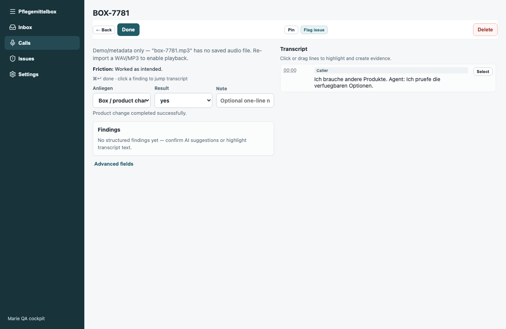
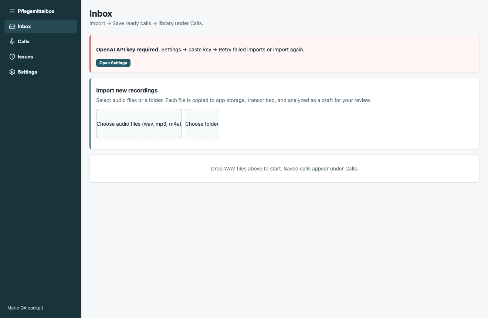
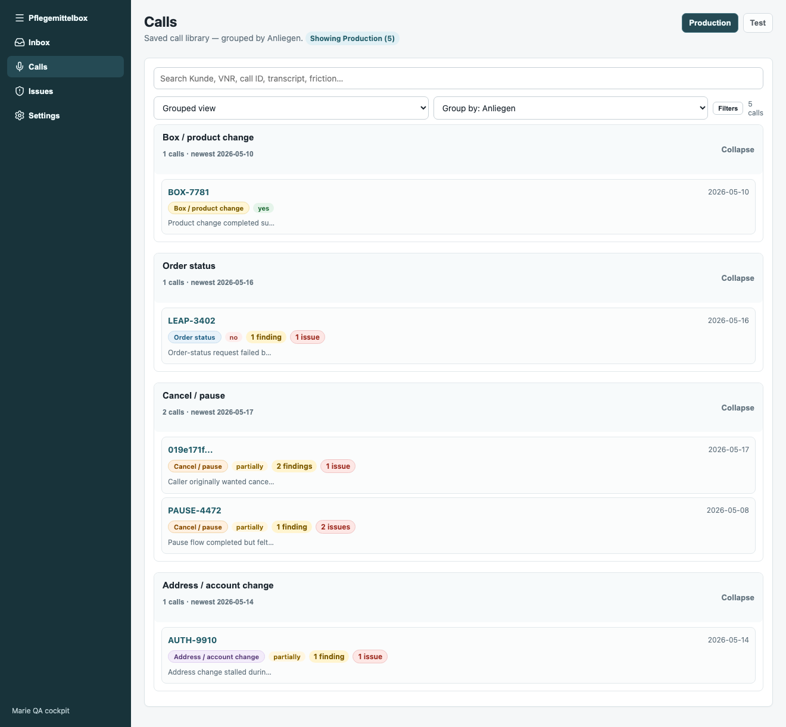
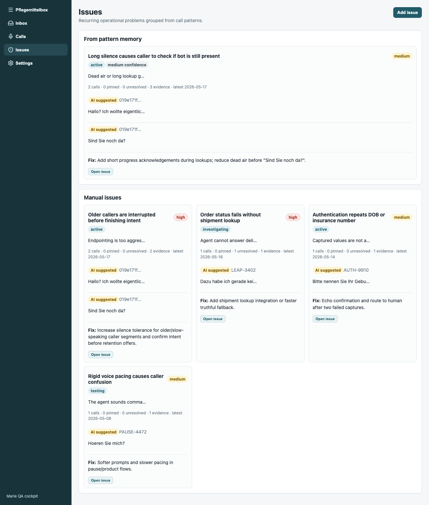

# Pflegemittelbox QA (Marie QA Cockpit)

Production-grade QA cockpit for German **Pflegebox / Pflegehilfsmittel** subscription phone calls handled by the Marie voice agent.

Operators ingest call recordings, review AI-assisted analysis, flag issues with evidence, and track patterns across production calls — all in a native macOS desktop app built for daily QA workflows.

## Screenshots

### Call review — transcript, findings, and evidence

Review a single call with Anliegen classification, result tracking, AI findings, and a highlightable German transcript. Reviewers can flag issues and pin evidence directly from the transcript.



### Inbox — import and triage pipeline

Drop WAV/MP3/M4A files or entire folders. Each recording is copied to app storage, transcribed, and analyzed as a draft before entering the call library.



### Calls — production library with filters

Browse grouped production calls, filter by result and workflow area, and open any call for full review.



### Issues — pattern tracking across calls

Track recurring friction, workflow-area tags, and open investigations. Issue-first UX surfaces what needs fixing in the Marie voice agent.



## What it does

- **Inbox pipeline** — import recordings, triage drafts, batch folder ingest
- **Transcription & extraction** — caller intent (Anliegen), entities, friction signals
- **Multi-agent analysis** — acoustic engine, audio listener, signal engine
- **Evidence moments** — highlight transcript excerpts, reviewer notes, flag issues
- **Issue tracking** — patterns across calls, workflow-area taxonomy, investigations
- **Operator-first UX** — dashboard, calls, issues, settings; built for daily review
- **Eval suite** — reference calls and scenario tests for regression checks

## Tech stack

| Layer | Technology |
|-------|------------|
| Desktop shell | Tauri 2 |
| Frontend | React, TypeScript, Vite |
| Backend | Rust |
| AI | OpenAI API (transcription, extraction, investigation) |
| Data | Local SQLite + file storage |
| Testing | Playwright UI exploration, reference-call eval scripts |

## Run locally

```bash
npm install
npx playwright install chromium   # optional, for ui:explore screenshots
npm run tauri:dev
```

Set your OpenAI API key in **Settings** on first launch.

## Build desktop app

```bash
npm run build:desktop
```

Installs a fresh `Pflegemittelbox.app` to your Desktop.

## Eval & testing

```bash
npm run eval:reference    # score against reference calls
npm run test:analysis     # analysis scenario tests
npm run ui:explore:full   # capture UI screenshots (Playwright)
```

## Project context

Evolved from [AI Call QA Cockpit](https://github.com/zayzyyazy/ai-call-qa-cockpit) into a vertical product for German Pflegebox phone operations. Domain-specific prompts, Marie Anliegen taxonomy, and operator workflows are tuned for real subscription-call QA — not a generic chatbot wrapper.

## Author

**[zayzyyazy](https://github.com/zayzyyazy)**
